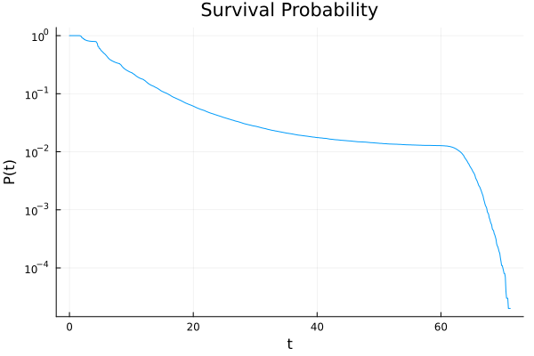
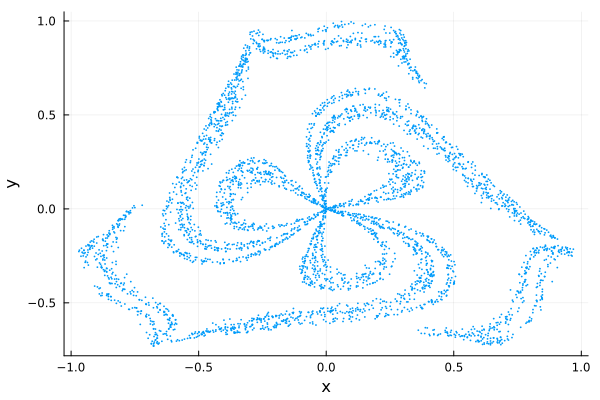

# Dissipative Chaotic Scattering
This repository contains the Julia code used to generate the results in the paper "Probabilistic description of dissipative chaotic scattering".

## Packages
The simulations were performed mainly using the  [DifferentialEquations.jl](https://github.com/SciML/DifferentialEquations.jl) and [DynamicalSystems.jl](https://juliadynamics.github.io/DynamicalSystems.jl/dev/) libraries. Other third-party libraries used were:

1. [CSV.jl](https://csv.juliadata.org/stable/) and [DataFrames.jl](https://dataframes.juliadata.org/stable/) (for saving/loading/manipulating data) 
2. [LsqFit.jl](https://github.com/JuliaNLSolvers/LsqFit.jl) (for curve-fitting, where necessary)
3. [Plots.jl](https://docs.juliaplots.org/stable/) (for visualisations).

**Familiarity with the syntax and operation of these tools is necessary.**

## Setup
In this paper we considered the Hénon-Heiles system with an added friction $\gamma$ : 

$$
\begin{equation}
\begin{aligned}
    &\dot{x} = p_x,\\
    &\dot{y} = p_y,\\
    &\dot{p_x} = -\omega^2x - 2\lambda xy - \gamma p_x,\\
    &\dot{p_y} = -\omega^2y - \lambda(x^2 - y^2) - \gamma p_y,
\end{aligned}
\end{equation}
$$

We were interested in statistical properties of ensembles of trajectories. All of the source codes are included in `dissipative_scattering_functions.jl`, which can loaded with `include("/src/dissipative_scattering_functions.jl")`. 


## Example Usage
### Survival Probability

To simulate an ensemble of $npts$ initial conditions chosen uniformly from the configuration space $(x,y)$ with initial energy $E$ and dissipation strength $\gamma$,
you can call `EnsembleSurvivalTime_D(npts,E,γ)`. This returns an `EnsembleSolution` object. 
The information returned by the integrator is user specified (see the documentation for `DifferentialEquations.jl`),
but by default `EnsembleSurvivalTime_D` supplies only the escape/settling time of each trajectory (for memory reasons). When the escape time is presented as a `DataFrame` under a column `t`, the function `SurvivalProbabilityCurve`
will generate another `DataFrame` with two columns `t` and `p`, information which represents the survival probability. 

To turn this information into a plot of the survival probability, one can do the following (here we choose (`npts`,E,γ) = (10^5,0.3,0.01)) :

```julia
sim = EnsembleSurvivalTime_D(10^5,0.3,0.01)

df = DataFrame(t = sim.u)
dfs = SurvivalProbabilityCurve(df)
plot(dfs.t,dfs.p,yscale=:log10,lab=false,xlab="t",ylab="P(t)",title="Survival Probability")

```
which produces 




### Conditionally-invariant measure 

The following code demonstrates how to produce images like Figure 5 in the paper. This can be quite memory intensive/take a long time.

```julia
### first need to specify what the section condition is (are we plotting after a certain time or when the energy is in some range)?
### This is done as another callback (see [here](https://docs.sciml.ai/DiffEqDocs/stable/features/callback_functions/))
### We will create a callback function for both, but use the time condition in this example (you could also combine them)
### the poincare surface is \dot{r} = 0, \dot{ϕ} > 0. it is written in cartesian coordinates in the function. the \dot{r} condition has a tolerance of 0.001.

tspan_comp = (0.0,80.0) #max integration time (much reduced for memory reasons, here it is from 0 to approx where escape is not possible)
t_crossing_i = 17.0 #(approx time until average energy is 0.3 if started at 0.35)
t_crossing_f = 30.0 #max time points have to cross the section until we stop looking. if we wait too long, their energy will be very different from 0.3.

function psos_condition_time(u,t,integrator)
    (t > t_crossing) && (abs(u[1]*u[3]+u[2]*u[4]) < 1e-3) && ((-u[3]/u[2] > 0) || (u[4]/u[1]) > 0) 
end

function psos_condition_energy(u,t,integrator)
    (Emin < u[5] < Emax) && (abs(u[1]*u[3]+u[2]*u[4]) < 1e-3) && ((-u[3]/u[2] > 0) || (u[4]/u[1]) > 0) 
end

### we will stop integrating when this condition is reached:
psos_affect!(integrator) = terminate!(integrator)

### create callback:
cb_psos = DiscreteCallback(psos_condition_time,psos_affect!)

### add in the other callbacks (escape, energy < Ec, etc)
cb_D4 = CallbackSet(cb_escape_diss2,cb_psos,cb_D)


### generate and integrate the ensemble
#solver options. saving too frequently causes memory issues. in extreme cases only saving the endpoints (save_everystep=false) is probably fine. 
diffeq_D8 = (alg = Vern9(),saveat=5.0,callback=cb_D4,abstol=1e-10,reltol=1e-10,maxiters=1e10);

#this function is like the other EnsembleSurvivalTime_D... functions, it just uses the solver options above.
simD_psos = EnsembleSurvivalTime_D4(5*10^6,0.35,0.01) 

### many of the trajectories will terminate because of escape. We only want to see the ones that:
# 1. survive until at least t_crossing_i, but didn't take too long to cross.
# 2. terminate inside the scattering region. We will filter out the points that dont satisfy this
simDf_psos = filter(x -> (t_crossing_i < x.t[end] < t_crossing_f),simD_psos.u) #only long lived points (but not too long...)
simDf_psos = filter(x -> norm(x.u[end][1:2]) < 1,simDf_psos) #only points that didn't escape

### now we extract the final position of the remaining points. These should be where they crossed the section.

umDp = DataFrame(x = Float64[], y = Float64[],t = Float64[]) #can add another column to keep track of the energy at time of crossing
for x in simDf_psos
    push!(umDp,[x.u[end][1],x.u[end][2],x.t[end]])
end

### plot

plot(umDp.x,umDp.y,st=:scatter,ms=1,msw=0,xlab="x",ylab="y",lab=false)

```
Which produces



As you can see, you need a lot of initial points to get a visible image.

